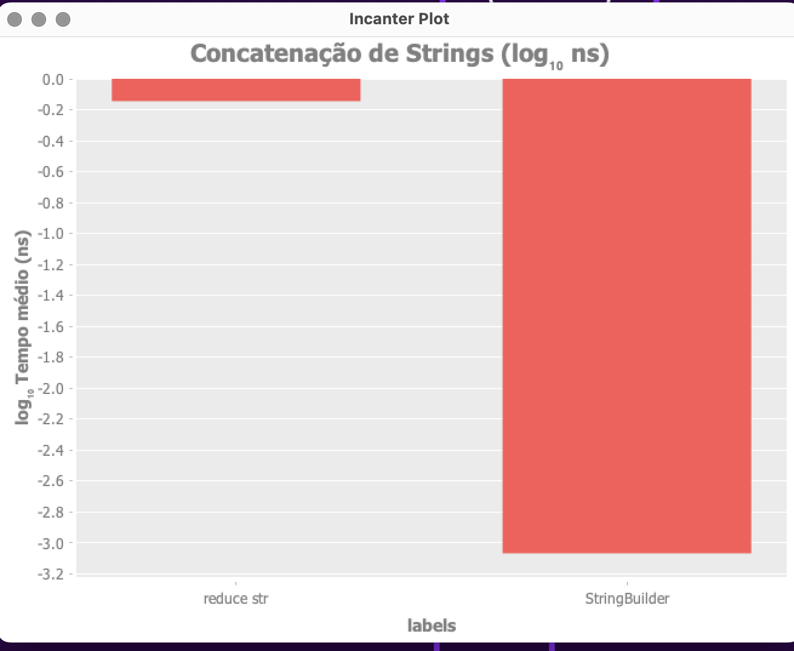

# Benchmark de Concatenação de Strings em Clojure

## Objetivo
Comparar o desempenho de duas abordagens para concatenação de strings em Clojure:
- `reduce str` (concatenação ingênua)
- `StringBuilder` (concatenação eficiente)

## Algoritmo (Passo a Passo Funcional)

### 1. Concatenação ingênua (reduce str)

**Pseudocódigo:**

1. Comece com uma string vazia.
2. Para cada elemento da lista de partes:
   - Concatene a string acumulada com o próximo elemento usando `str`.
   - O resultado é uma nova string (as anteriores não são reaproveitadas).
3. Retorne a string final.

**Resumo:**
- Cada passo cria uma nova string, copiando todo o conteúdo anterior.
- O custo cresce rapidamente conforme o número de partes aumenta.

### 2. Concatenação eficiente (StringBuilder)

**Pseudocódigo:**

1. Crie um buffer mutável (StringBuilder).
2. Para cada elemento da lista de partes:
   - Adicione (append) o elemento ao buffer.
3. Ao final, converta o buffer para uma string comum.

**Resumo:**
- O buffer é reaproveitado durante todo o processo.
- O custo cresce linearmente com o número de partes.

## Referências de Medição
- **Biblioteca:** [Criterium](https://github.com/hugoduncan/criterium) — ferramenta robusta para benchmarks estatísticos em Clojure.
- **Documentação:** [Criterium no cljdoc](https://cljdoc.org/d/criterium/criterium/0.4.6/api/criterium.core), [StringBuilder (Java)](https://docs.oracle.com/javase/8/docs/api/java/lang/StringBuilder.html), [reduce (Clojure)](https://clojuredocs.org/clojure.core/reduce), [str (Clojure)](https://clojuredocs.org/clojure.core/str)

## Funções testadas

```clojure
(defn using-str-concat [parts]
  (reduce str "" parts))

(defn using-string-builder [parts]
  (let [sb (StringBuilder.)]
    (doseq [part parts]
      (.append sb part))
    (.toString sb)))
```

## Metodologia
- **Entrada:**
  ```clojure
  (def parts (repeat 100000 "abc"))
  ```
  100.000 strings de 3 caracteres cada.
- **Execução:**
  - Cada função é executada usando `criterium.core/quick-benchmark`.
  - Resultados apresentados em nanossegundos (ns) e em escala logarítmica para facilitar a comparação.
- **Reprodutibilidade:**
  - Rode o código em qualquer ambiente Clojure com as dependências abaixo.
  - Compare os resultados em diferentes máquinas, JVMs ou tamanhos de entrada.

## Código-fonte completo

```clojure
(ns clojure-benchmarks.core
  (:require [criterium.core :as c]
            [incanter.core :as i]
            [incanter.charts :as charts]))

(def parts (repeat 100000 "abc"))

(defn using-str-concat [parts]
  (reduce str "" parts))

(defn using-string-builder [parts]
  (let [sb (StringBuilder.)]
    (doseq [part parts]
      (.append sb part))
    (.toString sb)))

(defn log10 [x]
  (Math/log10 (max x 1e-9))) ; evita log(0)

(defn -main [& args]
  (println "Benchmark de concatenação de strings em Clojure\n")
  (println "reduce str:")
  (let [res1 (c/quick-benchmark (using-str-concat parts) {})]
    (c/report-result res1)
    (println "Valor bruto :mean reduce str:" (:mean res1))
    (println "\nStringBuilder:")
    (let [res2 (c/quick-benchmark (using-string-builder parts) {})]
      (c/report-result res2)
      (println "Valor bruto :mean StringBuilder:" (:mean res2))
      (let [mean1 (when (and (map? res1) (vector? (:mean res1))) (first (:mean res1)))
            mean2 (when (and (map? res2) (vector? (:mean res2))) (first (:mean res2)))]
        (when (and (number? mean1) (number? mean2))
          (let [labels ["reduce str" "StringBuilder"]
                vals   [(double mean1) (double mean2)] ; agora em ns
                logvals (mapv log10 vals)
                chart  (charts/bar-chart labels logvals
                                        :title "Concatenação de Strings (log₁₀ ns)"
                                        :y-label "log₁₀ Tempo médio (ns)")]
            (i/view chart)
            (println "\nValores médios (ns):")
            (println (format "reduce str    : %.2f ns" (first vals)))
            (println (format "StringBuilder : %.2f ns" (second vals)))))))))
```

## Resultados Obtidos

```
reduce str:
Evaluation count : 6 in 6 samples of 1 calls.
             Execution time mean : 717.211033 ms
    Execution time std-deviation : 89.255165 ms
   Execution time lower quantile : 671.938666 ms ( 2.5%)
   Execution time upper quantile : 871.631467 ms (97.5%)
                   Overhead used : 1.346514 ns
Valor bruto :mean reduce str: [0.7172110333333335 (0.6791472421666667 0.8264299155)]

StringBuilder:
Evaluation count : 738 in 6 samples of 123 calls.
             Execution time mean : 854.949992 µs
    Execution time std-deviation : 21.929433 µs
   Execution time lower quantile : 829.519325 µs ( 2.5%)
   Execution time upper quantile : 881.341732 µs (97.5%)
                   Overhead used : 1.346514 ns
Valor bruto :mean StringBuilder: [8.549499918699188E-4 (8.400203970189702E-4 8.697464010840109E-4)]
```

## Gráfico

> **Imagem do gráfico gerado pelo Incanter:**
>
> 

## Como reproduzir e tirar provas reais
1. Clone o repositório ou copie o código acima.
2. Adicione as dependências no seu `project.clj`:
   ```clojure
   [criterium "0.4.6"]
   [incanter "1.9.3"]
   ```
3. Rode o projeto com `lein run` ou pelo REPL.
4. Altere o valor de `parts` para testar diferentes tamanhos de entrada.
5. Compare os resultados em diferentes ambientes.
6. Use o gráfico para comunicar visualmente a diferença de desempenho.

## Conclusão

Os resultados deste benchmark deixam claro que a escolha do algoritmo de concatenação de strings faz toda a diferença em aplicações que lidam com grandes volumes de dados. A abordagem ingênua com `reduce str` é simples, mas extremamente ineficiente para listas grandes, pois cria muitas cópias intermediárias e tem custo quadrático. Já o uso do `StringBuilder` (ou de funções que o utilizam internamente, como `clojure.string/join`) é muito mais eficiente, pois utiliza um buffer mutável e realiza a concatenação em tempo linear.

Além disso, o uso de ferramentas de benchmark como o Criterium e a visualização em escala logarítmica permitem identificar e comunicar diferenças de performance que podem chegar a várias ordens de magnitude — algo que pode passar despercebido em testes superficiais.

Portanto, ao desenvolver em Clojure (ou em qualquer linguagem baseada na JVM), prefira sempre abordagens otimizadas para manipulação de strings quando a performance for relevante. E lembre-se: medir, analisar e visualizar são passos fundamentais para tomar decisões técnicas embasadas.

## Referências
- [Criterium no GitHub](https://github.com/hugoduncan/criterium)
- [Incanter no GitHub](https://github.com/incanter/incanter)
- [StringBuilder (Java)](https://docs.oracle.com/javase/8/docs/api/java/lang/StringBuilder.html)
- [reduce (Clojure)](https://clojuredocs.org/clojure.core/reduce)
- [str (Clojure)](https://clojuredocs.org/clojure.core/str) 

## Autor

Elton Peixoto — Software Engineer
